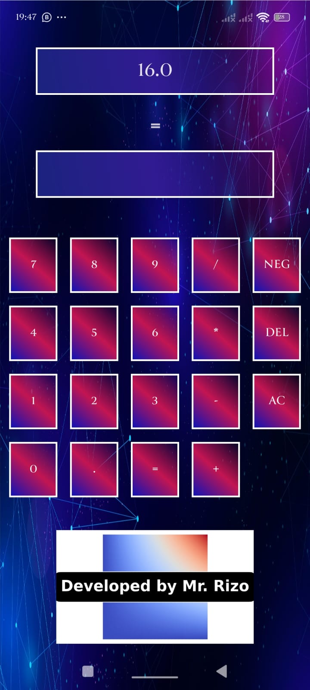
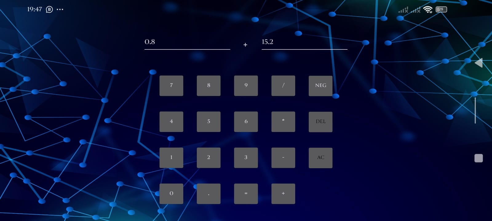

# 📱 Android Calculator App

A simple and user-friendly Android calculator built using **Kotlin** and **Android Studio**.  
This app performs basic arithmetic operations and ensures a smooth user experience.

---

## 🔹 **Features**
✅ **Basic Arithmetic Operations** – Addition (+), Subtraction (-), Multiplication (*), and Division (/)  
✅ **Negative Number Support** – Convert a number to negative/positive  
✅ **Delete Button** – Remove the last entered digit  
✅ **Clear Button** – Reset the result and current operation  
✅ **Screen Rotation Support** – Data remains after rotating the screen  
✅ **Modern UI** – Sleek design with a futuristic background  

---

## 🚀 **Technologies Used**
- **Programming Language:** Kotlin  
- **Development Environment:** Android Studio  
- **UI Design:** ConstraintLayout, Material Design  
- **Data Management:** `onSaveInstanceState()` and `onRestoreInstanceState()`  

---

## 📸 Screenshots
c

### 🔹 Calculation Result (Portrait Mode)

### 🔹 Main Screen

### 🔹 Calculation Result

## 📥 **Installation and Setup**
### **1. Clone the Repository**

 
git clone https://github.com/rizvandavudov/Calculator.git
2. Open in Android Studio
Open Android Studio
Click "File" → "Open" and select the cloned repository
Wait for Gradle build to finish
3. Run the Application
Connect a physical device via USB or use an Android Emulator
Click "Run" (▶) Button to launch the app

✨ Future Enhancements
 Add Advanced Mathematical Operations (Square, Square Root, Percentage)
 Implement Dark Mode
 Improve UI animations and transitions

 

📝 Author
👤 Rizvan Davudov
📧 rizvan.davudov@yahoo.com | 🔗 LinkedIn   https://www.linkedin.com/in/rizvan-davudov-8b995b325/

📜 License
This project is licensed under the MIT License. See the LICENSE file for details.

---

✅ **Project Overview** – Explains what the app does  
✅ **Features** – Lists the key functions of the calculator  
✅ **Installation Guide** – Steps to run the app  
✅ **Technologies Used** – Mentions Kotlin, Android Studio, and UI frameworks  
✅ **Future Enhancements** – Shows what improvements can be made  
✅ **Screenshots Section** – You can add images to make the repo look better  
✅ **Project Structure** – Helps developers understand file organization  
✅ **Author Information** – Your contact details  

